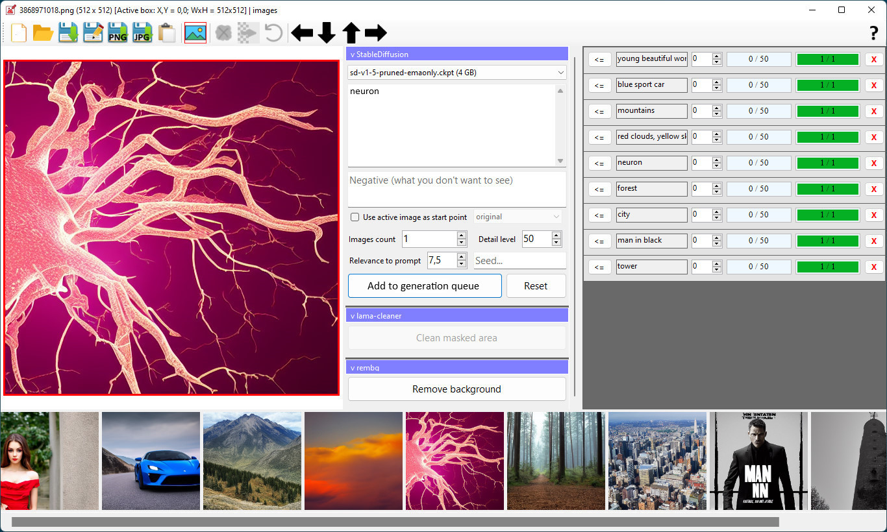
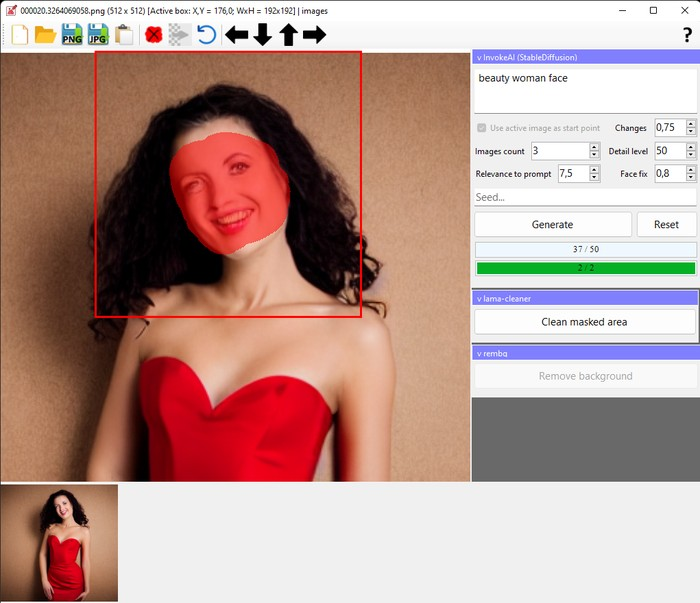

# AiPainter

Digital AI painter. Features:
 
 * generate pictures by text description (generate via [StableDiffusion](https://github.com/AUTOMATIC1111/stable-diffusion-webui));
 * regenerate specified areas of image (inpaint via [StableDiffusion](https://github.com/AUTOMATIC1111/stable-diffusion-webui));
 * remove specified objects from pictures (inpaint via [lama-cleaner](https://github.com/Sanster/lama-cleaner));
 * remove background from pictures (via [rembg](https://github.com/danielgatis/rembg)).

## Outpainting (animated gif)

## Requirements

 * Windows 8+ (x64)
 * NVIDIA video card (>4GB RAM, CUDA 11.4)
 * 16 GB disk space

Tested on NVIDIA 3060.
 

## Using

 * download precompiled AiPainter from [mega.nz](https://mega.nz/file/4s9g1J4I#3aTgiSDkXFZUZy2G4pUXwPCdzKIze_EmGzdnmua-SNQ)
 * or from torrent (magnet:?xt=urn:btih:d6f6af47f4e9ba9d1db9a4d2fcebb86e58401b61&dn=aipainter-1.3.0.zip)
 * unpack
 * run `AiPainter.exe`

## Troubleshooting

 * look into `logs` folder
 * check `Config.json`

## Contribution

 * install [Anaconda](https://docs.anaconda.com/anaconda/install/windows/)
 * install MS Visual Studio Community 2022
 * `git clone git@github.com:yar3333/ai-image-processing.git --recurse-submodules`
 * look into subfolders in `_external` and fix paths in `*.cmd` helpers to conda `envs` directory
 * run `create_conda_env.cmd` helpers to prepare conda environments
 * now you can use `run.cmd` helpers to run python projects
 * open `AiPainter.sln` in Visual Studio and build it
